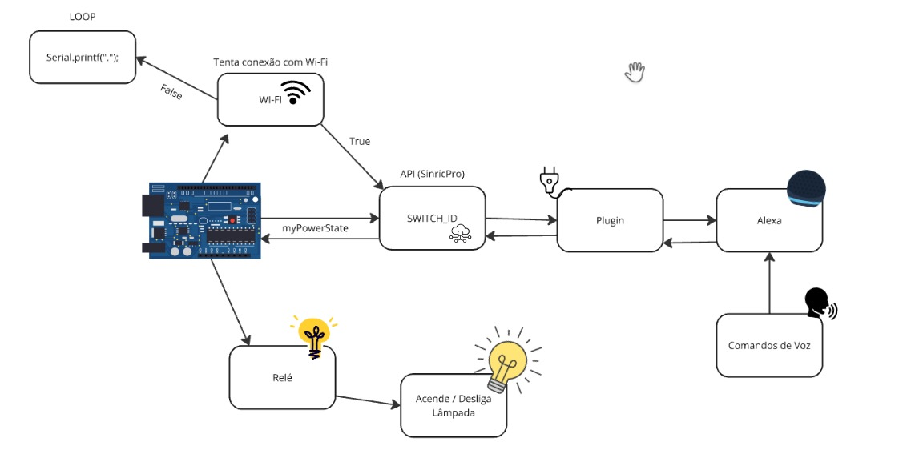

# Integração com Alexa

##### Este projeto tem o objetivo de conectar a ESP8266 com o uma rede Wi-Fi e ser controlado remotamente via a API SinricPro. Essa que faz a integração com a placa e a Alexa.

## Código main.cpp

#### **Bibliotecas Necessárias**:

   ```cpp
#include <Arduino.h>
#include <ESP8266WiFi.h>
#include <SinricPro.h>
#include <SinricProSwitch.h>
   ```

   Essas bibliotecas permitem a conexão com Wi-Fi e a integração com a API SinricPro.

#### **Conexão com a API SinricPro**:


   ```cpp
#define WIFI_SSID " "
#define WIFI_PASS ""
#define APP_KEY ""
#define APP_SECRET ""
#define SWITCH_ID "6"
#define BAUD_RATE 9600
   ```

#### Conexão Wi-Fi

A função `setupWiFi` realiza a conexão do ESP8266 com a rede Wi-Fi e exibe o endereço IP no monitor serial ao estabelecer a conexão como anteriormente mostrado nas fases anteriores do projeto.

```cpp
void setupWiFi() {
  Serial.printf("\r\n[WiFi]: Connecting");
  WiFi.begin(WIFI_SSID, WIFI_PASS);
  while (WiFi.status() != WL_CONNECTED) {
    Serial.printf(".");
    delay(250);
  }
  Serial.printf("connected!\r\n[WiFi]: IP-Address is %s\r\n", WiFi.localIP().toString().c_str());
}
```

#### Configuração SinricPro

A função `setupSinricPro`  faz a conexão com o SinricPro e define as chamadas para os comandos remotos.

```cpp
void setupSinricPro() {
  SinricProSwitch& mySwitch = SinricPro[SWITCH_ID];
  mySwitch.onPowerState(onPowerState);
  SinricPro.onConnected([](){ Serial.printf("Connected to SinricPro\r\n"); });
  SinricPro.onDisconnected([](){ Serial.printf("Disconnected from SinricPro\r\n"); });
  SinricPro.begin(APP_KEY, APP_SECRET);
}
```

#### Controle com o botão

A função `handleButtonPress` lida com a pressão do botão físico, alternando o estado do dispositivo e enviando o novo estado para o SinricPro.

```cpp
void handleButtonPress()
{
  unsigned long actualMillis = millis();
  if (digitalRead(BUTTON_PIN) == LOW && actualMillis - lastBtnPress > 1000)
  {
    myPowerState = !myPowerState;
    digitalWrite(RELE_PIN, myPowerState ? LOW : HIGH);
	
    // Envia o novo estado para o servidor SinricPro
	
    SinricProSwitch &mySwitch = SinricPro[SWITCH_ID];
    mySwitch.sendPowerStateEvent(myPowerState);
    Serial.printf("Device %s turned %s (manually via flashbutton)\r\n",
                  mySwitch.getDeviceId().c_str(), myPowerState ? "on" : "off");
    lastBtnPress = actualMillis;
  }
}
```


## Arquitetura

#### Como o projeto opera:

<p align="center">
  
</p>

## Imagens do Desenvolvimento do Projeto

#### Operação:

<p align="center">

</p>
